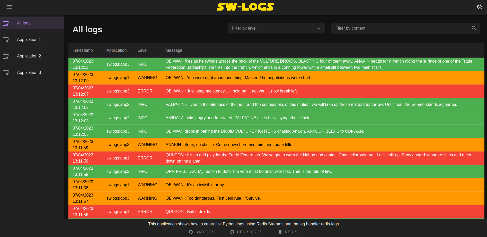
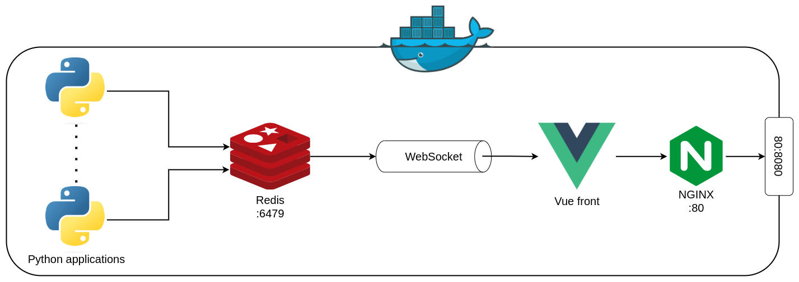

# sw-logs

Example project of Python logs centralization using [redis-logs](https://github.com/Iglesys347/redis-log-handler)



This project is composed of 3 main parts:

- multiple Python application generating logs and forwarding them to a Redis Stream using [redis-logs](https://github.com/Iglesys347/redis-log-handler) (see [log-generator](./log-generator/))
- a Vue JS application to display the logs (see [front](./front/))
- a WebSocket to send log data to the front (see [ws](./ws/))

## Getting started

The whole application can be started using docker-compose:

```bash
docker compose up
```

This will start the following services:

- a Redis DB
- 3 Python applications generating logs forwarded to Redis. The logs generated are read from the scripts of Star Wars episode 1-3
- a WebSocket retrieving logs from Redis
- a static web application served behind NGINX



You can then stop all the services with:

```bash
docker compose down
```
